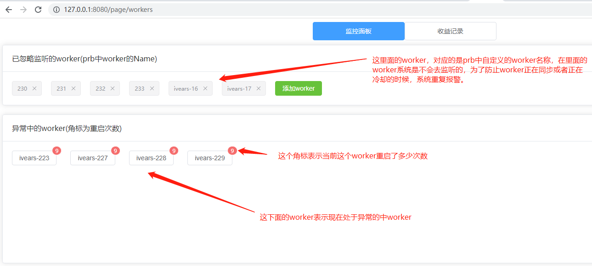
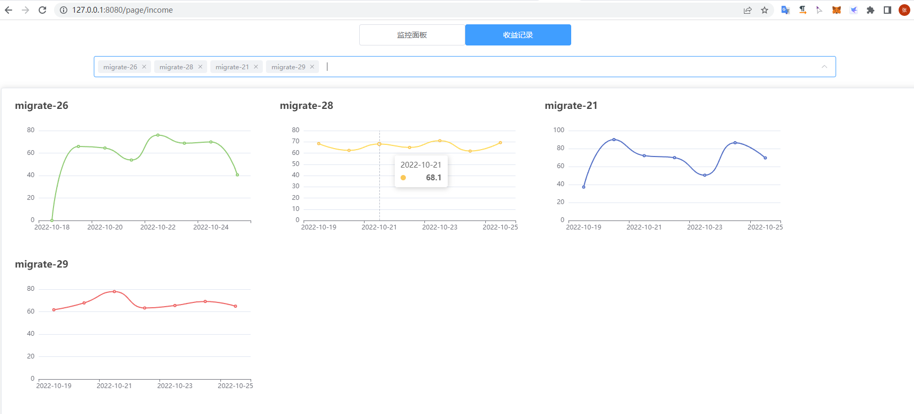

## phala-monitor (phala-监控)
<p align="center">

</p>
<p align="center">
<a href="https://opensource.org/licenses/MIT"></a>
<a href="https://golang.org"></a>
<a href="https://gin-gonic.com/zh-cn/docs/examples/html-rendering/"></a>
<a href="https://element-plus.org/zh-CN/"></a>
</p>


## 项目简介
`Phala-monitor`是一个由`Go语言`编写的phala监控程序。

`Epusdt` 遵守 [MIT](https://opensource.org/licenses/MIT) 开源协议!

## 设计实现
`Phala-monitor`是在`Runtime Bridge V2`（也就是`PRB`的部署的，后面都简称`PRB`）的基础上做的监控，所有只支持使用`PRB`的搭建方式。


> ### 主要逻辑说明
> `每分钟`请求一次prb中的接口 获取worker信息和状态，如果状态为异常，自动重启worker并用邮箱报警通知，如果重启后worker依然异常，则后续`每五分钟`重启一次，`每12小时`报警一次，直至worker`正常为止`。

## 项目特点
- 监控phala的worker是否处于正常mining状态。
- worker异常后自动重启恢复。
- 异常邮箱报警。
- 记录worker每日收益，并用图表展示。
- 无需搭建复杂的环境，只需要配置好prb接口和邮箱信息即可使用。
- 迁移便捷：复制phala-monitor再任何有docker环境的机器上即可。

## 项目结构
```
phala-monitor
    ├── common ---> (公共文件)
    ├── cron ---> (定时任务）
    ├── db ---> (数据管理和模型)
    ├── global ---> (全局调用)
    ├── web ---> (web服务)
    └── wiki ---> (知识库)
```

## 教程：
- 部署说明👉🏻[傻瓜式一键部署](wiki/deploy.md)

## 界面尝鲜

#### 监控界面


#### 收益界面



## 意见反馈
- `QQ`[972858472](http://wpa.qq.com/msgrd?v=3&uin=2519955172&site=qq&menu=yes)


### 如果该项目对您有所帮助，希望您动动小手点个star
